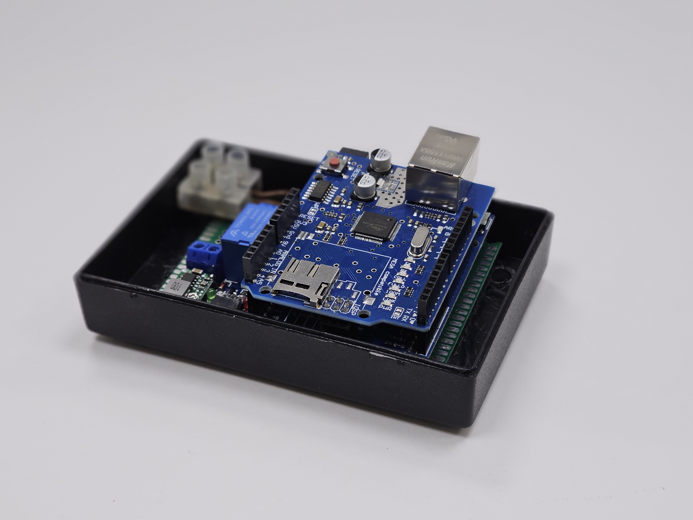
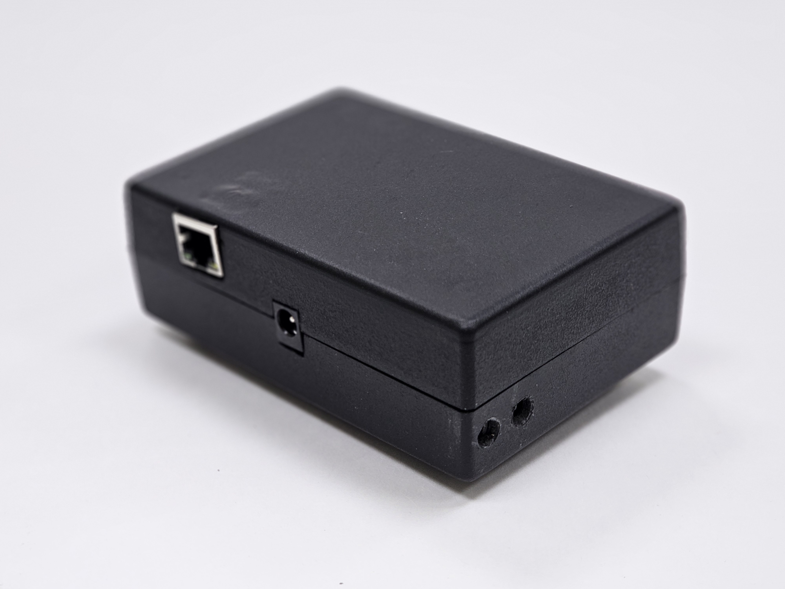
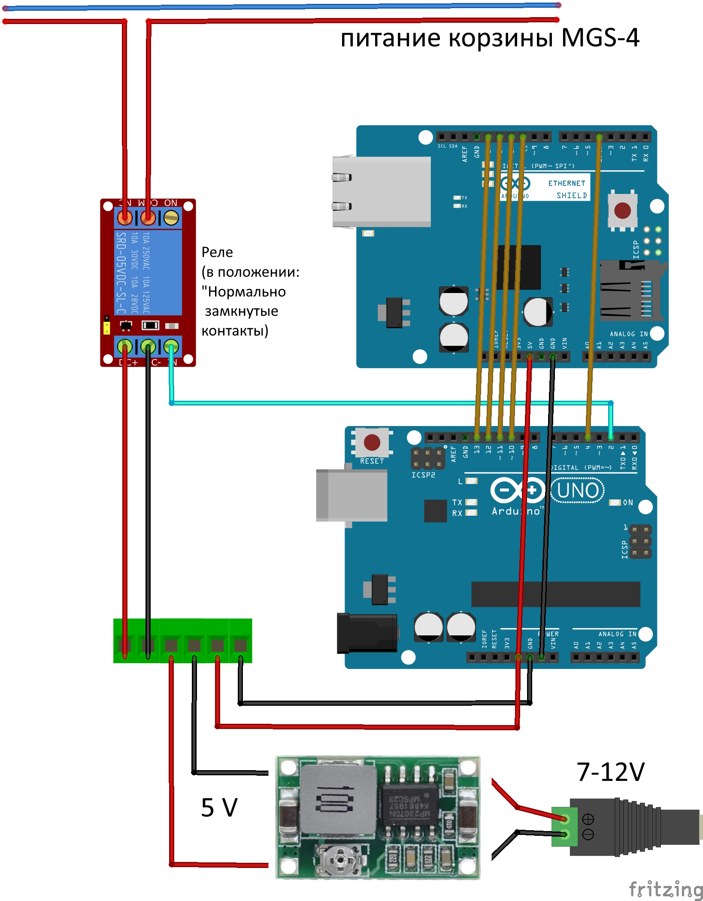
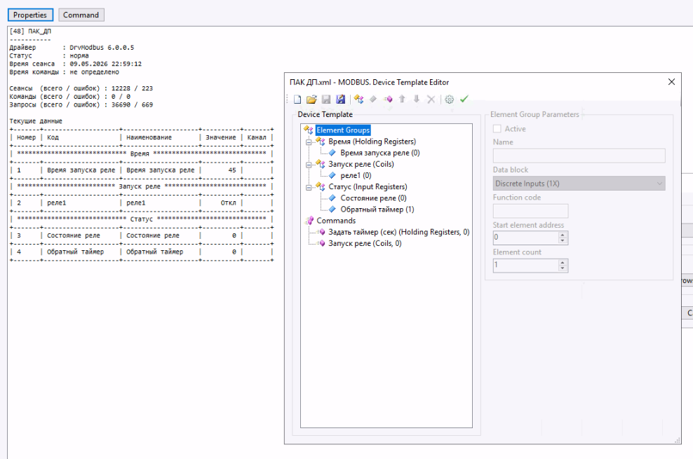
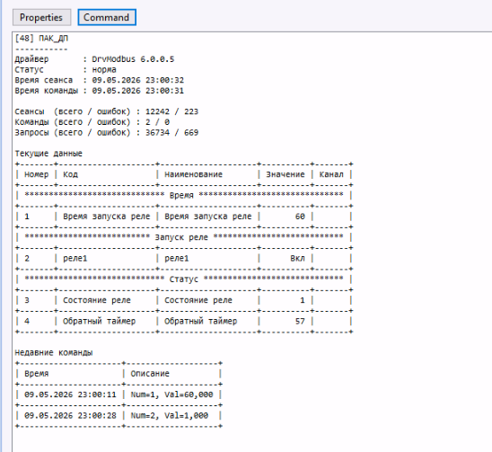

# SCADA Modbus TCP Relay Timer

Arduino-based Modbus TCP slave device for remote relay control from a SCADA system.

The device receives relay commands over Modbus TCP, runs the relay for a configurable time interval, reports the current relay state and remaining time back to SCADA, and stores the configured relay time in EEPROM so it survives power loss.

## Features

- Modbus TCP slave for SCADA integration.
- Relay control through Modbus coils.
- Configurable relay runtime through a holding register.
- Relay state and remaining timer value exposed through input registers.
- EEPROM storage for the relay runtime setting.
- Non-blocking relay timer based on `millis()`.
- Ethernet link watchdog for W5100/W5500 recovery after cable disconnect/reconnect.
- Optional hardware reset line for the W5100 Ethernet module.
- Uses the [`ModbusTCP_RU`](https://github.com/UterGrooll/ModbusTCP_RU) library.

## Related Library

This project is built on top of my Arduino Modbus TCP library:

[`UterGrooll/ModbusTCP_RU`](https://github.com/UterGrooll/ModbusTCP_RU)

The firmware uses this library to expose coils, input registers, holding registers, and write callbacks for SCADA-side control.

## Hardware

Tested target hardware:

- Arduino-compatible controller.
- W5100 or W5500 Ethernet module/shield.
- Relay module.
- SCADA or Modbus Poll client on the same TCP/IP network.

Default pin assignment:

| Signal | Arduino pin | Notes |
| --- | ---: | --- |
| Relay output | `2` | Active LOW relay module logic |
| W5100 reset | `3` | Drives Ethernet module reset line |
| Ethernet CS | `10` | Set with `Ethernet.init(10)` |

## Device Photos





## Example Wiring



## Network Configuration

Default firmware network settings:

```cpp
byte mac[] = {0x90, 0xA5, 0xDA, 0x0E, 0x94, 0xB5};
IPAddress ip(192, 168, 1, 178);
IPAddress gateway(192, 168, 1, 1);
IPAddress subnet(255, 255, 255, 0);
```

Modbus TCP port: `502`.

Change these values in the sketch before uploading if your network uses a different subnet or the MAC address conflicts with another device.

## Modbus Map

See [docs/modbus-map.md](docs/modbus-map.md) for the full register map and Modbus Poll examples.

Short version:

| Type | Address | Function | Description |
| --- | ---: | --- | --- |
| Coil | `0` | `FC01`, `FC05`, `FC15` | Relay command: `0 = OFF`, `1 = ON` |
| Input Register | `0` | `FC04` | Actual relay state: `0 = OFF`, `1 = ON` |
| Input Register | `1` | `FC04` | Remaining relay time in seconds |
| Holding Register | `0` | `FC03`, `FC06`, `FC16` | Relay runtime in seconds |

Default relay runtime: `300` seconds.

Allowed relay runtime range: `1` to `3600` seconds.

## Firmware

The Arduino sketch is located in:

```text
firmware/ScadaRelayTimer/ScadaRelayTimer.ino
```

Required libraries:

- `SPI`
- `Ethernet`
- `EEPROM`
- [`ModbusTCP_RU`](https://github.com/UterGrooll/ModbusTCP_RU)

## Basic Operation

1. SCADA writes `1` to `Coil 0`.
2. The Arduino turns the relay on.
3. The relay timer starts.
4. SCADA reads the relay state and remaining time from input registers.
5. When the timer expires, the relay turns off automatically.
6. SCADA can write a new runtime value to `Holding Register 0`.
7. The new runtime value is saved to EEPROM.

## Modbus Poll Examples

Turn the relay on or off:

```text
Function: 05 Write Single Coil
Address: 0
Value: ON / OFF
```

Read relay state and remaining time:

```text
Function: 04 Read Input Registers
Address: 0
Quantity: 2
```

Read configured relay runtime:

```text
Function: 03 Read Holding Registers
Address: 0
Quantity: 1
```

Write a new relay runtime:

```text
Function: 06 Write Single Register
Address: 0
Value: 120
```

Writing `120` makes the relay run for 120 seconds. The value is saved in EEPROM and remains after power cycling.

## Rapid SCADA Example

Rapid SCADA screenshots showing the device configuration and relay control test.





## Notes

This project was created as a modernization of an existing relay control device. The old `MgsModbus` dependency was removed and replaced with `ModbusTCP_RU`.

## License

This repository currently includes an MIT license draft. Review and change it before publishing if you prefer a different license.
